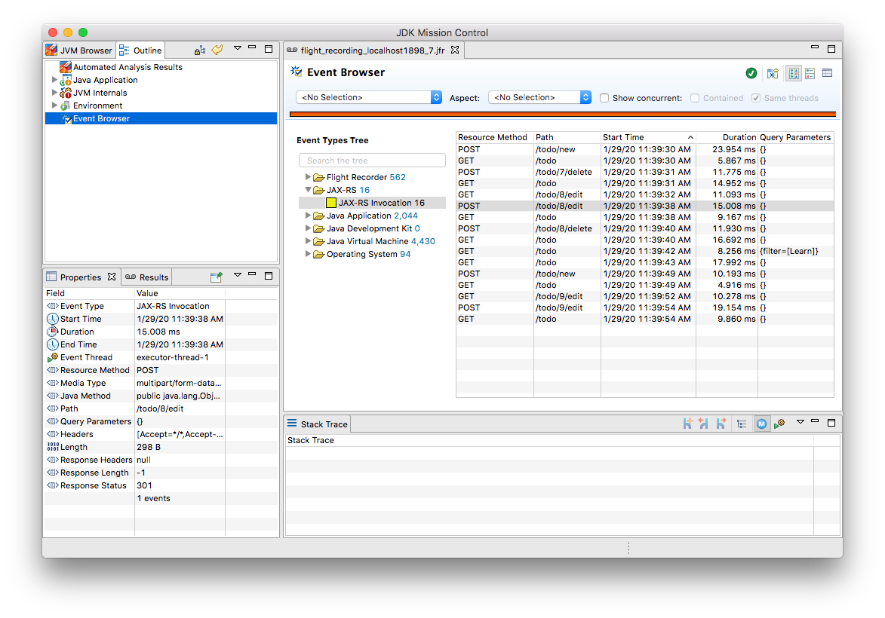
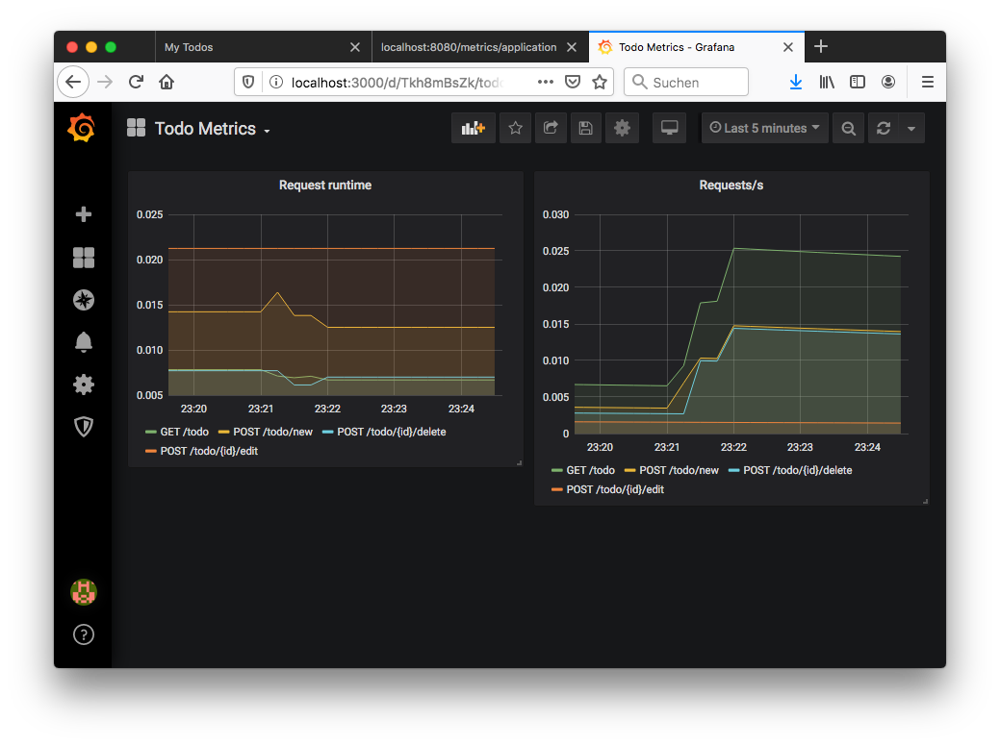
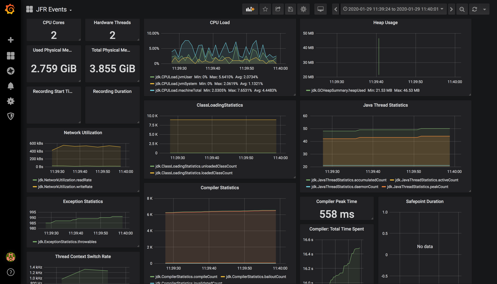

# Java Flight Recorder Custom Events

Example code accompanying the [blog post](https://www.morling.dev/blog/rest-api-monitoring-with-custom-jdk-flight-recorder-events/) "Monitoring REST APIs with Java Flight Recorder Custom Events".
It shows how to use custom event types with Java Flight Recorder and Mission Control to gain insight into runtime performance of a JAX-RS based REST API.
It also demonstrates how to export Flight Recorder events in realtime via MicroProfile Metrics, using the Flight Recorderstreaming API added in Java 14.





Update Feb. 8th: the example has been expanded to show the usage of the [JFR datasource](https://github.com/rh-jmc-team/jfr-datasource) for Grafana.

## Build

Make sure to have Java 14 installed.
Run the following to build this project:

```shell
# Example service
mvn clean package -f example-service/pom.xml

# JFR datasource for Grafana
mvn clean package -f jfr-datasource/pom.xml

docker-compose up --build
```

Open the web application at http://localhost:8080/.
You then can connect to the running application on port 1898 using Mission Control,
start Flight Recorder and observe "JAX-RS" events in the recording.
You also can observe the exported metrics via Grafana at http://localhost:3000/.

## Loading JFR Recordings into Grafana

The JFR datasource has been setup in Grafana.
To examine a JFR recording, load it into the datasource:

```shell
curl -F "file=@/path/to/my/recording.jfr" localhost:8081/load
```

Then open the "JFR Events" dashboard in Grafana and zoom into the time range of the recording.



# License

This code base is available ander the Apache License, version 2.
